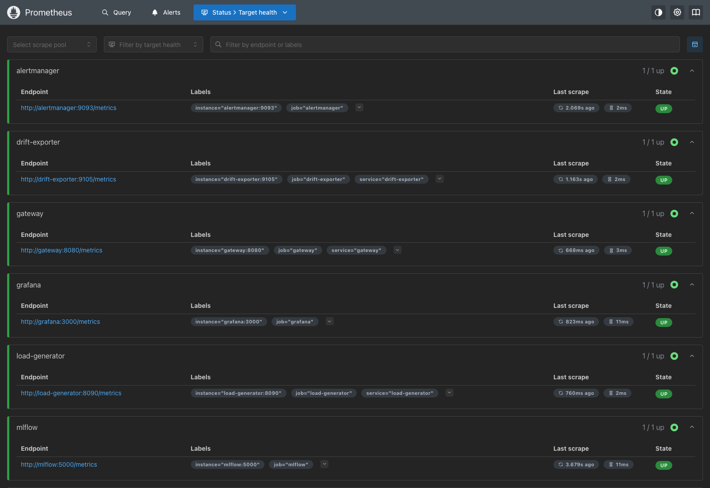
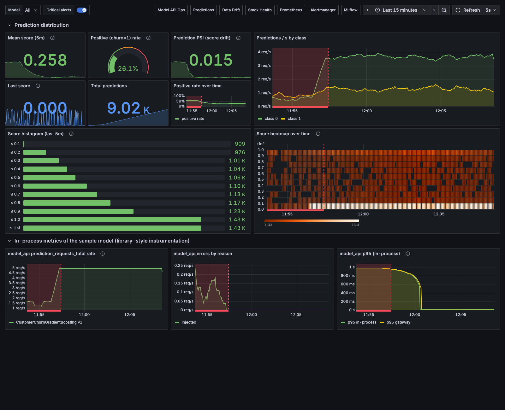
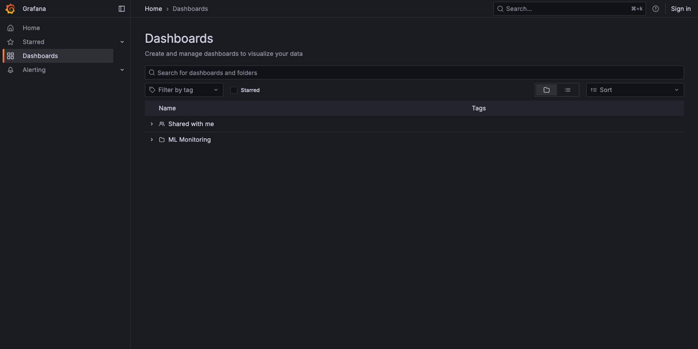
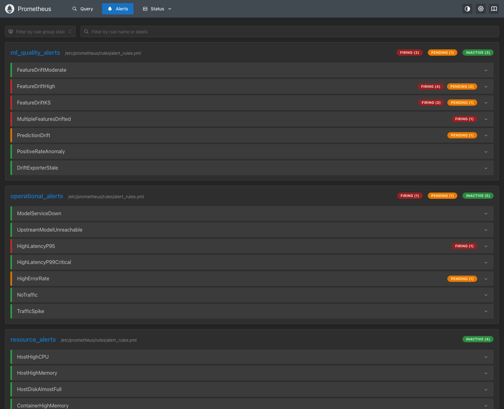
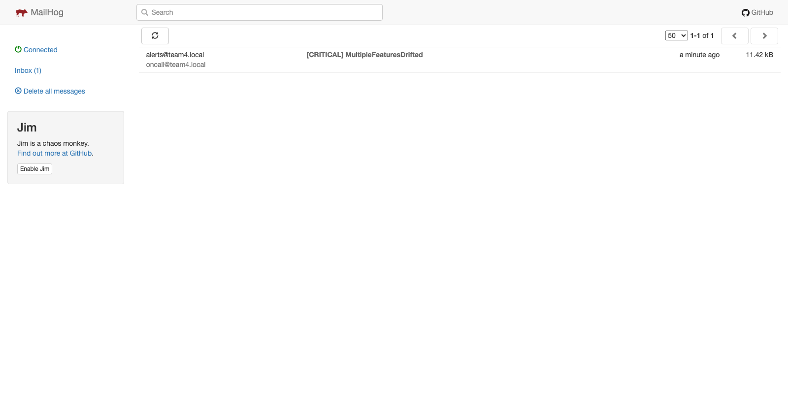

<div class="cover" markdown="1">
<h1>Real-Time Model Monitoring &amp; Alerting Stack</h1>
<div class="sub">A Production-Grade MLOps Project (Project 4)</div>
<div class="tools">Prometheus · Grafana · Alertmanager · Custom Drift Exporter (PSI/KS) · psutil System Exporter · ZenML · MLflow · Optuna · Docker Compose · GitHub Actions · Render</div>
<div class="by">Submitted By</div>
<table><tr><td><b>Gurrala Rohith Kumar</b></td><td>2511042210013</td></tr><tr><td><b>Vijeta S Alavani</b></td><td>2511042210011</td></tr><tr><td><b>Abhilash M K</b></td><td>2511042210012</td></tr></table>
<div style="margin-top:50pt;font-size:10pt;color:#444;text-align:center">Repository: <a href="https://github.com/AutomationArtist01/MLOPS">https://github.com/AutomationArtist01/MLOPS</a><br>Monitored model: Telco Customer-Churn classifier (team <i>customer-churn-mlops</i>)</div>
</div>

# 1 Objective / Problem Statement

## 1.1 Problem Statement

Machine-learning services fail *silently*. An HTTP endpoint keeps answering `200 OK` while the model's input distribution
drifts away from the data it was trained on, or while a serving bug scrambles the features before they reach the model.
Ordinary infrastructure monitoring (CPU, memory, uptime) cannot see either. The objective of this project is to design,
build and productionise a **reusable, model-agnostic real-time monitoring and alerting stack** that gives any deployed
model both *operational* and *ML-quality* observability, and that alerts humans through Slack and e-mail before there is
business impact.

Concretely, the project delivers:

1. **Prometheus exporters** for the four operational signals of a prediction service — request rate, latency
   (p50/p95/p99), error rate — plus the domain-specific *prediction distribution*, implemented twice: **inside** the
   model service (`services/model_api/api.py`) and as a **model-agnostic gateway** (`services/gateway/gateway.py`) that
   instruments *any* HTTP model without code changes.
2. A **custom drift exporter** (`services/drift_exporter/`) that computes the Population Stability Index (PSI) and the
   two-sample Kolmogorov–Smirnov test per feature, and PSI on the model score, on a **rolling window** of live requests
   against a training-time reference profile.
3. A **psutil system exporter** (`services/system_exporter/`) for hardware saturation — host CPU, memory, swap, disk,
   network, load and per-container CPU/memory.
4. **Grafana dashboards** built from scratch as code (four dashboards, 65 panels) and **18 Prometheus alert rules**
   (operational, ML-quality, resource) routed by **Alertmanager** to Slack and e-mail with grouping and inhibition.
5. A **ZenML pipeline** (`services/trainer/pipeline.py`) — ingest → validate (pipeline-halting checks) → split → Optuna
   tuning tracked in **MLflow** → evaluate → quality-gated promotion to the **MLflow Model Registry** → drift-reference
   export.
6. A **Docker Compose** stack of eleven services runnable with one command, a **Render** blueprint for the model API,
   and a **GitHub Actions** CI/CD pipeline (lint, unit tests, config validation, image builds, full-stack smoke test).
7. Documentation: this report and a 40-page technical guidebook (`docs/Team4-Monitoring-Guidebook.pdf`) explaining
   *why* each tool was chosen over its alternatives, and how to wire the stack to a new model.

The monitored model is the **Telco Customer-Churn classifier** built by the *customer-churn-mlops* team (Gradient
Boosting, Optuna-tuned, MLflow/skops artifact, FastAPI). Wrapping another team's model was a deliberate choice: it
proves the stack is independent of any single model.

## 1.2 Business / Technical Relevance

* **Business relevance.** A churn model drives retention offers. If its inputs drift (new tariff, new customer segment,
  a changed upstream ETL) or its outputs collapse (a serving bug), the company keeps acting on wrong scores for weeks
  before anyone notices — labels for churn arrive months later. Real-time drift and prediction-distribution monitoring is
  the *leading indicator* that lets the team react in minutes.
* **Technical relevance.** Every team in the cohort deploys a model; each of them needs the same signals. A stack that
  attaches to a model with three environment variables and one scrape job removes the need to re-implement monitoring
  per project and standardises alerting across teams (§ 13, § 19).

## 1.3 Dataset Justification

The stack is built around the **IBM Telco Customer Churn** dataset — 7 043 customers, 19 input features (4 numeric,
15 categorical), target `Churn` with 26.5 % positives — for three reasons:

* It is the dataset the wrapped model was trained on, so it is the *correct reference distribution* for drift detection.
* It is small enough to train and tune on CPU inside the 15-hour budget (25 Optuna trials with 3-fold CV finish in under a
  minute) yet realistic (mixed types, missing `TotalCharges` for new customers, class imbalance).
* Replaying real rows through the API gives realistic traffic for the demo; the drift scenario shifts real customers
  (younger tenure, higher charges, month-to-month contracts) rather than inventing data.

The assignment explicitly states that *no new dataset is needed* for Project 4.

## 1.4 Success Metrics (defined upfront)

| Metric | Definition | Target / Use |
|---|---|---|
| ROC-AUC (hold-out), F1 | quality of the (re)trained churn model | ≥ 0.84 AUC; the registry step **refuses** AUC < 0.80 |
| p95 latency (`ml:latency_p95:5m`) | 95th percentile of `/predict` latency over 5 min | SLO < 500 ms; alert `HighLatencyP95` |
| Error ratio (`ml:error_ratio:5m`) | 5xx / all requests over 5 min | SLO < 5 %; alert `HighErrorRate` (critical) |
| Availability (`ml:availability:30m`) | 1 − error ratio over 30 min | ≥ 99 % |
| Feature drift (`drift_psi`, `drift_ks_*`) | PSI and KS per feature vs training reference | PSI > 0.25 = significant; alert within ≤ 3 min of a shift |
| Prediction drift (`drift_prediction_psi`, positive rate) | PSI of the score histogram; share of class-1 predictions | alerts `PredictionDrift`, `PositiveRateAnomaly` |
| Saturation (`sys_cpu_percent`, `sys_memory_percent`, `container_memory_bytes`) | host and per-container resources | alerts at 85 % CPU, 90 % RAM, 90 % disk |
| Alert delivery | notifications reach the right receiver | 100 % of demo scenarios delivered to Slack + e-mail |
| Reusability | effort to monitor a *new* model | env vars + one scrape job, no model code change |

## 1.5 Scope vs. the 15-Hour Budget

Exporter design/coding 5 h · Docker Compose orchestration 3 h · Dashboards 3 h · Alertmanager rules 2 h · Docs/demo 2 h.
The repository layout mirrors this split (`services/`, `monitoring/`, `docs/`). Deliberate scope decisions: Docker Compose
instead of Kubernetes (single-host demo, identical concepts); a custom, transparent drift exporter instead of a heavy
library (Evidently could replace the maths without changing interfaces); PSI + KS rather than multivariate detectors;
demo notification sinks (Mailhog, a Slack webhook catcher) so the whole stack runs offline while a real webhook/SMTP is
one `.env` file away.

# 2 System Architecture

```
                       demo scenarios (normal / drift / latency / errors / burst / bad_payload)
                       ┌───────────────────┐
                       │  load-generator   │ :8090  (samples real Telco rows, POSTs to gateway)
                       └────────┬──────────┘
                                │ POST /predict
                                ▼
┌───────────────┐      ┌───────────────────┐  POST /predict   ┌───────────────────────┐
│  any client   │─────►│  monitoring       │─────────────────►│  model-api  :8000     │
│  (curl, app)  │◄─────│  GATEWAY  :8080   │◄─────────────────│  churn model (FastAPI │
└───────────────┘      │  /metrics mlgw_*  │  JSON response   │  + MLflow/skops)      │
                       └───┬───────────┬───┘                  │  /metrics prediction_*│
                           │           │ async POST /ingest   └───────────┬───────────┘
                           │           ▼                                  │ /chaos (demo only)
                           │  ┌───────────────────┐   ┌───────────────────┐
                           │  │  drift-exporter   │   │  system-exporter  │ :9106  psutil:
                           │  │  :9105  PSI + KS  │   │  host CPU/RAM/disk│ CPU·RAM·disk·net
                           │  │  rolling window   │   │  + docker stats   │ + per-container
                           │  └─────────┬─────────┘   └─────────┬─────────┘
   scrape (pull) every 5s  │            │                       │
┌──────────────────────────┴────────────┴───────────────────────┴───────────────────┐
│  PROMETHEUS :9090     TSDB · 10 recording rules (ml:*) · 18 alert rules           │
└──────────┬──────────────────────────────────────────────────┬────────────────────┘
           │ alerts (push)                                     │ PromQL
           ▼                                                   ▼
┌───────────────────────┐  Slack webhook  ┌──────────┐    ┌───────────────────────────┐
│  ALERTMANAGER :9093   │────────────────►│ Slack    │    │  GRAFANA :3000            │
│  group·route·inhibit  │  SMTP           │ (catcher)│    │  4 provisioned dashboards │
└───────────────────────┘────────────────►│ Mailhog  │    └───────────────────────────┘
                                          └──────────┘
┌───────────────────────┐    ┌──────────────────────────────────────────────────────┐
│  MLFLOW :5001         │◄───│  trainer = ZenML pipeline: ingest → validate(gate) → │
│  tracking + registry  │    │  split → Optuna tune (25 trials) → evaluate →         │
└───────────────────────┘    │  register(@champion) → drift reference → CSV          │
                             └──────────────────────────────────────────────────────┘
```

Every box is a container in `docker-compose.yml`; Prometheus also scrapes itself, Alertmanager, Grafana and MLflow
(meta-monitoring). The data flow for one prediction is: client → gateway → model → gateway records status/latency/score
→ gateway streams `{features, prediction, score}` to the drift exporter *asynchronously* (never on the request path) →
Prometheus scrapes every 5 s, evaluates recording and alert rules → firing alerts are pushed to Alertmanager → grouped,
routed, delivered → Grafana visualises the same series and overlays critical alerts as annotations.

# 3 Project Structure

```
MLOPS/
├── README.md                          problem statement · quick start · layout · pipeline · deployment
├── Makefile                           make up | train | smoke | test | lint | report | scenario-* | down
├── docker-compose.yml                 the stack (11 services)
├── docker-compose.second-model.yml    overlay: attach a 2nd model (the other team's ORIGINAL image)
├── render.yaml                        Render blueprint for the model API
├── .github/workflows/ci.yml           GitHub Actions CI/CD
├── requirements-dev.txt · pyproject.toml   dev tooling (ruff, pytest) and lint config
├── services/
│   ├── model_api/        other team's churn API + skops model, transformer-order fix, ML metrics, /chaos
│   ├── gateway/          model-agnostic Prometheus exporter/proxy (mlgw_*)
│   ├── drift_exporter/   PSI + KS rolling-window exporter, build_reference.py, reference profile
│   ├── system_exporter/  psutil hardware exporter (sys_*, container_*)
│   ├── load_generator/   traffic replay + demo scenarios
│   ├── webhook_catcher/  fake Slack sink for offline demos
│   ├── mlflow/           MLflow tracking server + registry image
│   └── trainer/          ZenML pipeline (pipeline.py, run_pipeline.py)
├── monitoring/
│   ├── prometheus/       prometheus.yml · rules/recording_rules.yml · rules/alert_rules.yml
│   ├── grafana/          provisioning/ · build_dashboards.py → dashboards/*.json
│   └── alertmanager/     alertmanager.yml · templates/slack.tmpl · entrypoint.sh
├── tests/                test_units.py (pytest) · smoke_test.py (E2E) · alert_status.py · sample_request.json
├── data/telco_churn.csv  artifacts/                (mlflow_runs.csv, telco_reference.json)
├── docs/                 Team4-Project-Report.pdf · Team4-Monitoring-Guidebook.pdf · report/ (sources)
└── external/customer-churn-mlops/   unmodified snapshot of the other team's repository (+ PROVENANCE.md)
```

Every service is a self-contained folder with its own `Dockerfile`, `requirements.in` (direct dependencies) and a
fully pinned `requirements.txt` produced with `uv pip compile` (§ 16).

# 4 Configuration (docker-compose.yml, Makefile, .env)

All wiring is declarative. The **gateway** block is the only thing that changes when the stack is pointed at a
different model:

{{code:docker-compose.yml:24:61}}

The Compose file also carries the psutil exporter (Docker socket mounted read-only for per-container statistics),
Prometheus with hot-reload enabled, Alertmanager with an env-substituting entrypoint, Grafana with provisioning and
anonymous *Viewer* access (for kiosk demos and headless screenshots), the demo notification sinks, MLflow and the
`trainer` under a Compose *profile* so it only runs on demand:

{{code:docker-compose.yml:62:100}}

Real Slack / SMTP credentials go into `.env` (never committed; `.env.example` documents the keys); the defaults route to
the local demo sinks:

{{file:.env.example}}

Day-to-day operations are wrapped in the `Makefile` (`make up`, `make train`, `make smoke`, `make scenario-drift`,
`make report`, …).

# 5 Shared Utilities — Data, Reference Profile, Sample Request

The Telco CSV (`data/telco_churn.csv`) is used by four components: the model API (fits its preprocessing exactly as
the other team's code does), the ZenML trainer, the drift reference builder and the load generator. The reference profile
consumed by the drift exporter is built by `services/drift_exporter/build_reference.py` — quantile bin edges and
probabilities for numeric features, category shares for categorical features, a 2 000-row sample for the KS test and,
optionally, the histogram of the model's own scores on the training data (prediction-drift baseline):

{{code:services/drift_exporter/build_reference.py:29:40}}

{{code:services/drift_exporter/build_reference.py:60:81}}

`tests/sample_request.json` is one real customer used by `make predict`, the smoke test and the API examples.

# 6 ML Pipeline — ZenML Orchestration (services/trainer/pipeline.py)

The project implements a **full ZenML pipeline** with eight distinct, reusable, independently-testable
`@step`-decorated functions wired together in a single `@pipeline`: **ingest → validate → split → tune/train →
evaluate → register → build drift reference → export CSV**. Each step has typed, `Annotated` inputs/outputs which
ZenML uses to cache and version artifacts between runs (the tuning step is explicitly `enable_cache=False`).

## 6.1 Step 1 — Data Ingestion

{{code:services/trainer/pipeline.py:67:72}}

## 6.2 Step 2 — Data Validation (with pipeline-halting checks)

The validation step actively checks schema, nulls, target values, class balance and value ranges, prints a JSON report,
and **raises** when anything fails — ZenML then marks the run failed and no downstream step executes. The unit tests
(§ 15) prove the gate halts on a missing column and on an artificially imbalanced target.

{{code:services/trainer/pipeline.py:75:115}}

## 6.3 Step 3 — Data Splitting / Transformation

{{code:services/trainer/pipeline.py:118:127}}

The scikit-learn preprocessing (`StandardScaler` for the 4 numeric, `OneHotEncoder(handle_unknown="ignore")` for the 15
categorical features) lives inside the model `Pipeline`, so training and serving can never disagree on column order —
exactly the bug found in the wrapped model (§ 17.3):

{{code:services/trainer/pipeline.py:55:58}}

## 6.4 Step 4 — Hyper-parameter Tuning and Training (Optuna + MLflow)

{{code:services/trainer/pipeline.py:130:193}}

## 6.5 Step 5 — Model Evaluation

{{code:services/trainer/pipeline.py:195:215}}

## 6.6 Step 6 — Model Registration (quality-gated)

{{code:services/trainer/pipeline.py:218:231}}

## 6.7 Steps 7–8 — Drift Reference and Run Export; Pipeline Definition

{{code:services/trainer/pipeline.py:234:262}}

{{code:services/trainer/pipeline.py:276:286}}

The pipeline runs in a container (`make train` → `docker compose run --rm trainer`) against the MLflow server; ZenML's
SQLite store lives in a named volume so `zenml pipeline runs list` shows history across restarts.


# 7 Experiment Tracking — MLflow

Every Optuna trial is a **nested MLflow run** under a parent `optuna-gbm-study` run, with parameters, CV metrics,
fit time and a `state=complete|pruned` tag; the parent run holds the study summary (`best_cv_roc_auc`,
`trials_pruned`), the full trial table (`optuna_trials.json`), Optuna parameter importances, the hold-out metrics and
the final model artifact (with signature and input example). The MLflow server (`services/mlflow/Dockerfile`) uses a
SQLite backend and a local artifact store in a named volume, exposes its own `/metrics` for Prometheus and whitelists
the in-network and host-mapped names (MLflow 3 rejects unknown `Host` headers):

{{code:services/mlflow/Dockerfile}}


# 8 Hyper-parameter Tuning — Optuna + Model Registry

**Search space** (`GradientBoostingClassifier`, the same family the other team used): `n_estimators` 50–300 (step 25),
`learning_rate` 0.01–0.3 (log), `max_depth` 2–6, `min_samples_split` 2–20, `min_samples_leaf` 1–10, `subsample`
0.6–1.0. **Sampler:** `TPESampler(seed=42)`. **Pruner:** `MedianPruner(n_startup_trials=5, n_warmup_steps=1)` — each
trial reports its running CV mean after every fold, so unpromising trials are stopped early (8 of 25 were pruned).
**Objective:** mean 3-fold stratified CV ROC-AUC. The best configuration is retrained on the full training split,
evaluated on the untouched 20 % hold-out and — only if hold-out AUC ≥ 0.80 — registered as a new version of
`telco-churn-classifier`, given the alias **`champion`** and the tags `stage=production`, `test_roc_auc`,
`validated_by=zenml-pipeline`.

| Item | Value |
|---|---|
| Trials / pruned | 25 / 8 |
| Best CV ROC-AUC | **0.8499** |
| Best parameters | `n_estimators=225, learning_rate=0.0379, max_depth=2, min_samples_split=9, min_samples_leaf=9, subsample=0.646` |
| Hold-out ROC-AUC · accuracy | **0.847** · 0.805 |
| Hold-out precision · recall · F1 | 0.670 · 0.521 · 0.587 |
| Registered | `telco-churn-classifier` **v3** → alias `champion`, tag `stage=production` |
| Other team's baseline | Optuna 35 trials, ROC-AUC 0.845 on their split |


# 9 Exporting Experiment History

The last pipeline step exports every run of the experiment (all trials, all metrics, all parameters) to
`artifacts/mlflow_runs.csv` via `mlflow.search_runs(...)`; the same export is available from the UI's *Download CSV*
button — one of the instructor's whiteboard items.

{{code:services/trainer/pipeline.py:264:273}}

# 10 Serving Layer — FastAPI Model Service (services/model_api/api.py)

The model service is the other team's FastAPI application serving their MLflow/skops artifact, with three additions:
(1) the transformer-order fix (§ 17.3), (2) Prometheus instrumentation *directly in the service code* (§ 11), and
(3) a demo-only `/chaos` endpoint that injects latency or failures so alerts can be shown firing (`CHAOS_ENABLED=0` on
Render). The prediction handler:

{{code:services/model_api/api.py:167:196}}

Health check and model loading (the model, its version and processed feature count are exposed for the health probe and
as the `model_info` metric):

{{code:services/model_api/api.py:127:152}}

## 10.1 Live API Documentation & Inference Evidence


# 11 Prometheus Instrumentation

## 11.1 In-process metrics (services/model_api/api.py)

{{code:services/model_api/api.py:53:82}}

## 11.2 The model-agnostic gateway (services/gateway/gateway.py)

The gateway is the reusable heart of the stack: it proxies `/predict` to any HTTP model, measures what the *client*
experiences, extracts the score/class from the response with configurable JSON paths, and feeds the drift exporter
asynchronously.

{{code:services/gateway/gateway.py:38:67}}

{{code:services/gateway/gateway.py:109:155}}

## 11.3 The custom drift exporter (services/drift_exporter/drift_exporter.py)

PSI = Σ (aᵢ − eᵢ)·ln(aᵢ/eᵢ) over reference-quantile bins (open outer bins, ε-smoothing, an "other" bucket for
unseen categories); KS from `scipy.stats.ks_2samp` against a 2 000-row training sample; both recomputed every 15 s over
a `deque(maxlen=500)` rolling window that the gateway fills through `/ingest`.

{{code:services/drift_exporter/drift_exporter.py:73:136}}

## 11.4 The psutil system exporter (services/system_exporter/system_exporter.py)

Hardware saturation is the fourth golden signal. The exporter samples psutil every 5 s (host CPU total and per core,
load average, memory, swap, disk, network counters, process count) and, when the Docker socket is mounted, per-container
CPU % and memory from the Engine API — the same numbers `docker stats` shows, but as time series with alerts.

{{code:services/system_exporter/system_exporter.py:57:102}}

## 11.5 Metric inventory

| Metric | Type | Purpose |
|---|---|---|
| `mlgw_requests_total{model,status}` · `prediction_requests_total{model,version}` | Counter | request rate, error ratio (`status=~"5.."`) |
| `mlgw_request_latency_seconds` · `prediction_request_latency_seconds` | Histogram (11 buckets 5 ms–10 s) | p50/p95/p99 via `histogram_quantile` |
| `mlgw_errors_total{reason}` · `prediction_errors_total{reason}` | Counter | upstream_5xx / client_4xx / timeout / connection / injected |
| `mlgw_prediction_score` · `prediction_probability` | Histogram (0.1 … 1.0) | prediction distribution |
| `mlgw_predictions_total{predicted_class}` · `predictions_total{predicted_class}` | Counter | positive-rate |
| `mlgw_upstream_up`, `mlgw_inflight_requests`, `model_loaded`, `model_info` | Gauge / Info | health, saturation, version label |
| `drift_psi{feature,type}`, `drift_ks_statistic`, `drift_ks_pvalue`, `drift_prediction_psi`, `drift_features_drifted` | Gauge | data & prediction drift |
| `drift_window_rows`, `drift_rows_ingested_total`, `drift_last_compute_timestamp`, `drift_compute_seconds` | Gauge / Counter | exporter liveness |
| `sys_cpu_percent`, `sys_cpu_percent_per_core`, `sys_load_average`, `sys_memory_*`, `sys_swap_bytes`, `sys_disk_*`, `sys_net_bytes_total` | Gauge / Counter | host hardware (psutil) |
| `container_cpu_percent{name}`, `container_memory_bytes{name}`, `container_memory_limit_bytes{name}` | Gauge | per-container resources |
| `loadgen_scenario`, `loadgen_target_rps`, `chaos_injected_latency_ms`, `chaos_injected_error_rate` | Gauge | demo state, visible on the dashboards |

## 11.6 Prometheus Scrape Configuration (monitoring/prometheus/prometheus.yml)

{{file:monitoring/prometheus/prometheus.yml}}

Recording rules (`monitoring/prometheus/rules/recording_rules.yml`) pre-compute the SLIs once so dashboards and alerts
share one definition of "p95" and "error ratio" (note the `or … * 0` zero-fill for the not-yet-existing 5xx series):

{{code:monitoring/prometheus/rules/recording_rules.yml:1:31}}

## 11.7 Prometheus Query Evidence



![Prometheus *Graph* — `histogram_quantile(0.95, sum by (le) (rate(mlgw_request_latency_seconds_bucket[5m])))`: p95 latency computed server-side from the histogram buckets (the whiteboard items *rate of change* and *time ranges* are demonstrated on this page by switching `[5m]`↔`[1h]` and the range picker).](screenshots/prom-graph.png)


# 12 Grafana Dashboards — Built From Scratch

## 12.1 Datasource Provisioning (monitoring/grafana/provisioning/datasources/prometheus.yml)

{{file:monitoring/grafana/provisioning/datasources/prometheus.yml}}

## 12.2 Dashboard Provider (monitoring/grafana/provisioning/dashboards/dashboards.yml)

{{file:monitoring/grafana/provisioning/dashboards/dashboards.yml}}

## 12.3 Dashboard-as-Code

The four dashboards (65 panels) are **generated** by `monitoring/grafana/build_dashboards.py` — a small Python DSL that
emits Grafana's panel-schema JSON with units, thresholds, overrides, a `$model` template variable, cross-links and an
annotation query that overlays critical alerts. Editing a panel = editing Python and running `make dashboards`; the CI
fails if the committed JSON is not reproducible from the code. Excerpt (the golden-signal stat row):

{{code:monitoring/grafana/build_dashboards.py:104:126}}

| Dashboard | Purpose | Highlights |
|---|---|---|
| **1 · Model API – Operational** | golden signals | rps, p95, error ratio, availability gauge, upstream up, in-flight; rate by status; p50/p95/p99/avg with SLO line; errors by reason; latency heatmap; demo-state row |
| **2 · Predictions** | model behaviour | mean score, positive-rate gauge, prediction PSI, predictions/s by class, score histogram + heatmap, in-process vs gateway p95 |
| **3 · Data Drift** | PSI/KS | drifted-count, window rows, PSI bar gauge (0.10/0.25 thresholds), PSI over time, KS D & p, live-vs-reference means, drift table |
| **4 · Stack Health** | meta + hardware | targets up, alerts, TSDB stats, notifications, scrape durations, exporter CPU; **psutil row**: host CPU/RAM/disk gauges, load, memory, network, per-core CPU, per-container CPU/memory |

## 12.4 Dashboard Evidence







# 13 Alerting — Prometheus Rules + Alertmanager

## 13.1 Alert rules (monitoring/prometheus/rules/alert_rules.yml)

18 rules in three groups. Every rule has a `for:` duration (alert on state, not on one bad scrape), a `severity` label used
for routing, a `category` label (operational / ml-quality) and a `runbook_url`. Excerpt:

{{code:monitoring/prometheus/rules/alert_rules.yml:27:52}}

{{code:monitoring/prometheus/rules/alert_rules.yml:84:110}}

| Group | Alerts |
|---|---|
| operational | ModelServiceDown, UpstreamModelUnreachable, HighLatencyP95, HighLatencyP99Critical, HighErrorRate, NoTraffic, TrafficSpike |
| ml-quality | FeatureDriftModerate, FeatureDriftHigh, FeatureDriftKS, MultipleFeaturesDrifted (critical), PredictionDrift, PositiveRateAnomaly, DriftExporterStale |
| resources (psutil) | HostHighCPU, HostHighMemory, HostDiskAlmostFull (critical), ContainerHighMemory |

## 13.2 Alertmanager routing (monitoring/alertmanager/alertmanager.yml)

{{code:monitoring/alertmanager/alertmanager.yml:20:56}}

Slack messages use a custom template (`templates/slack.tmpl`: summary, description, model/feature, since, runbook
link); e-mail uses `smtp_smarthost` → Mailhog in the demo. Because Alertmanager has no native environment substitution,
a 12-line `entrypoint.sh` renders `${SLACK_WEBHOOK_URL}` / `${SMTP_*}` from the container environment at start-up.

## 13.3 Alerting Evidence




![Notification evidence — the fake-Slack webhook catcher showing the JSON Slack received: `[FIRING:6] FeatureDriftHigh` grouped into one message on `#ml-quality`, `PredictionDrift`, and the critical `MultipleFeaturesDrifted` on `#ml-oncall`; Mailhog holds the matching critical e-mails.](screenshots/notifications.png)




# 14 Containerization & Deployment (Docker · Compose · Render)

## 14.1 Dockerfiles

Every service uses `python:3.12-slim`, copies `requirements.txt` first (layer caching), installs pinned dependencies,
then copies the code. The model API additionally ships the skops artifact and declares a `HEALTHCHECK` and a
`PORT`-aware start command for Render:

{{file:services/model_api/Dockerfile}}

{{file:services/gateway/Dockerfile}}

## 14.2 Docker Compose — full local stack

`docker compose up -d --build` builds and starts eleven services on one network with named volumes for
Prometheus/Grafana/Alertmanager/MLflow/ZenML state and read-only bind mounts for configuration (§ 4).
`docker-compose.second-model.yml` is an *overlay* that adds the other team's **unmodified** image behind a second
gateway — the reusability proof.


## 14.3 Render

`render.yaml` deploys `services/model_api` as a Docker web service with `/health` as the health-check path
(`CHAOS_ENABLED=0`). The local stack can monitor the cloud instance by pointing a gateway's `UPSTREAM_URL` at the Render
URL — the model itself needs no change.

{{file:render.yaml}}

> **Evidence pending at the time of writing:** the live Render URL and its health-check screenshot are added here (and to
> the README) once the blueprint is applied on the team's Render account; likewise the GitHub Actions run screenshot once
> the repository is pushed. Both artefacts (`render.yaml`, `.github/workflows/ci.yml`) are in the repository and the
> local equivalent of the CI job passes (§ 15).

# 15 CI/CD Pipeline — GitHub Actions (.github/workflows/ci.yml)

Three jobs on every push and pull request to `main`: **lint-and-test** (Ruff, pytest, `promtool check config/rules`,
`amtool check-config`, `docker compose config`, dashboards reproducible from code) → **docker-build** (matrix over the
seven images, pushed to GHCR on `main`) and **smoke-test** (boots the entire Compose stack inside the runner and executes
the 25-assertion end-to-end test).

{{code:.github/workflows/ci.yml:1:52}}

{{code:.github/workflows/ci.yml:53:110}}

# 16 Testing

* **Unit tests** `tests/test_units.py` (pytest, no Docker): PSI/KS mathematics, end-to-end drift detection on the exporter
  object (baseline vs shifted window), gateway JSON-path helper, reference-builder CLI, ZenML validation gate (passes on
  real data; halts on a missing column; halts on class imbalance), Prometheus/alert-rule/dashboard config sanity.
* **Smoke test** `tests/smoke_test.py` (25 assertions against the running stack): every service healthy, a prediction
  through the gateway, all `/metrics` endpoints, all scrape targets UP, recording rules producing values, drift window
  populated, dashboards provisioned, Alertmanager config, MLflow API.
* **Config validation** with the vendors' own tools (promtool, amtool, `docker compose config`).

{{code:tests/test_units.py:69:86}}


# 17 Pinned Dependencies

Each service declares its direct dependencies in `requirements.in` and ships a fully pinned `requirements.txt`
generated with `uv pip compile` (transitive versions included) so images build identically on any machine and in CI.
Runtime versions match the wrapped model's artifact exactly (`scikit-learn==1.9.0`, `mlflow==3.15.1`, skops):

{{code:services/model_api/requirements.in}}

{{code:services/trainer/requirements.in}}

# 18 Results Summary

| Run / Observation | Value | Source |
|---|---|---|
| Optuna trials · pruned | 25 · 8 | ZenML run log (Fig. 1), MLflow parent run |
| Best CV ROC-AUC · best params | 0.8499 · `n_est=225, lr=0.038, depth=2, …` | MLflow `optuna-gbm-study` |
| Hold-out ROC-AUC · F1 · precision · recall · accuracy | 0.847 · 0.587 · 0.670 · 0.521 · 0.805 | MLflow parent run metrics |
| Registered model | `telco-churn-classifier` v3 → `@champion`, `stage=production` | MLflow registry (Fig. 4) |
| Baseline serving (5 rps) | p95 ≈ 25 ms · error ratio 0 % · PSI < 0.15 on all features | Grafana 1 & 3 |
| Latency scenario (700 ms injected) | p95 ≈ 0.9 s, p99 ≈ 1 s → `HighLatencyP95` → Slack `#ml-alerts` | Fig. 12, 20 |
| Error scenario (30 % injected) | error ratio 16 % → `HighErrorRate` (critical) → `#ml-oncall` + e-mail | alert_status.py |
| Drift scenario | PSI up to 5.4 (tenure), 6 features > 0.25, KS D > 0.4, prediction PSI 0.81 → 12 grouped Slack notifications + critical e-mail within ~2 min | Fig. 13, 20–22 |
| Second model (other team's original image) | monitored with zero code changes; same customer scores 0.069 vs 0.087 | `docker-compose.second-model.yml` |
| Hardware baseline (Docker VM, 10 cores, 7.75 GiB) | CPU 1.7 % idle / ~15 % under burst · RAM 3.4 GiB (44 %) · model-api 371 MB, Grafana 350 MB, Prometheus 224 MB | Grafana 4 (Fig. 15) |
| Tests | 11 unit tests + 3 CI-only · 25 smoke assertions · ruff clean | Fig. 25, 26 |
| Repository | 23 granular commits, all deps pinned, README with setup | `git log` |

# 19 Wiring the Stack to a New Model (reuse guide)

**Level 0 — no code changes (~10 min).** Add the model and a gateway to Compose (copy from
`docker-compose.second-model.yml`) with `UPSTREAM_URL`, `PREDICT_PATH`, `HEALTH_PATH`, `MODEL_NAME`, `PROB_FIELD`,
`LABEL_FIELD`; add one `job_name` to `prometheus.yml`; `make reload-prom`; send traffic to the gateway. All operational
alerts and both operational dashboards work immediately (everything is grouped by the `model` label).

**Level 1 — drift (~30 min).** `python services/drift_exporter/build_reference.py --csv train.csv --numeric … --categorical …
--score-csv scores.csv --model NAME --out reference/NAME.json`; run a drift-exporter instance with `REFERENCE_PATH`; add its
scrape job. Feature names in the request JSON must match the CSV columns.

**Level 2 — in-process metrics (optional).** Ten lines of `prometheus_client` in the model (§ 11.1) give internals such as
feature-fetch time; the report's "in-process vs gateway" panels appear automatically.

{{code:docker-compose.second-model.yml:9:29}}

# 20 Challenges & Learnings

| Challenge | Resolution / learning |
|---|---|
| The wrapped model's API fits its `ColumnTransformer` with transformers ordered *(categorical, numeric)* while the model was trained with *(numeric, categorical)*; a NumPy array hides the mismatch → AUC 0.53 vs 0.94, mean score 0.09 vs 0.25 | fixed with a one-line reorder in our copy; documented; reported to the other team. **Lesson:** this is exactly why prediction-distribution monitoring exists — every operational signal stays green while the model is wrong (`PredictionDrift`, `PositiveRateAnomaly` catch it) |
| Strict version pins of the artifact (sklearn 1.9.0 + skops + MLflow 3.15) | matched exactly; `uv pip compile` pins for every service |
| MLflow 3 rejects unknown `Host` headers (`Invalid Host header`) | `--allowed-hosts` for the in-network name and the host port |
| macOS AirPlay occupies port 5000 | MLflow mapped to 5001 |
| `rate()` over a not-yet-existing 5xx series is *empty*, not 0 → "No data" panels | zero-fill with `or (… * 0)` in the recording rules |
| Alertmanager has no env-var substitution | 12-line entrypoint that `sed`s the config from the environment |
| KS p-value → 0 with large n, alerts too eager | require effect size `D > 0.2` as well |
| A second monitored model with no traffic tripped `NoTraffic` | rule now means "traffic dropped" (`max_over_time(...[30m]) > 0.5`) |
| Detection latency at low traffic (500-row window at 1.4 rps ≈ 6 min) | documented; `WINDOW_SIZE` is a tuning knob |
| ZenML's SQLite store needs the `zenml[local]` extra; a very slow network (~30 kB/s) made the 500 MB image build fail on hash checks | pinned `zenml[local]`; built locally on top of the previous image with pre-downloaded wheels (`Dockerfile.local`, git-ignored); CI builds normally |
| `node_exporter`/cAdvisor misbehave inside Docker Desktop on Apple Silicon | wrote the small psutil exporter instead — portable, and it also reports per-container stats through the Docker socket |
| Grafana table `merge` needs identical label sets | aggregate all three drift queries `by (model, feature)` |

# 21 Conclusion

The stack meets and exceeds Project 4's requirements: exporters for request rate, latency percentiles, error rate and
prediction distribution (in-process **and** model-agnostic); a custom PSI + KS drift exporter on a rolling window; a psutil
hardware exporter; four Grafana dashboards built from scratch as code; 18 alert rules routed by Alertmanager to Slack and
e-mail with grouping and inhibition; a one-command Docker Compose stack with the sample model API; and documentation
that lets another team attach their model with environment variables only — demonstrated live with a second, unmodified
model. Around the monitoring core it adds a ZenML pipeline with a gating validation step, Optuna tuning tracked in
MLflow with quality-gated registry promotion, CI that lints, tests, validates configurations, builds images and
smoke-tests the whole stack, and a Render deployment of the model API. Along the way it found and explained a real
serving bug in the wrapped model — the best possible argument for why this kind of monitoring matters.

**Next steps:** logs and traces (Loki/Tempo via OpenTelemetry), long-term storage (Thanos/Mimir), an accuracy exporter
once ground-truth labels arrive, segmented drift, and an automatic retraining trigger from `MultipleFeaturesDrifted`
into the ZenML pipeline.

# 22 References & Links

* Repository — https://github.com/AutomationArtist01/MLOPS (this report: `docs/Team4-Project-Report.pdf`;
  guidebook: `docs/Team4-Monitoring-Guidebook.pdf`)
* Other team's model repository — https://github.com/Nisarg7314/customer-churn-mlops (snapshot in `external/`)
* Prometheus — https://prometheus.io/docs/ · Alertmanager — https://prometheus.io/docs/alerting/latest/alertmanager/
* Grafana — https://grafana.com/docs/grafana/latest/ · MLflow — https://mlflow.org/docs/latest/
* ZenML — https://docs.zenml.io/ · Optuna — https://optuna.readthedocs.io/ · psutil — https://psutil.readthedocs.io/
* Google SRE Book, ch. 6 "Monitoring Distributed Systems" (golden signals) — https://sre.google/sre-book/monitoring-distributed-systems/
* Population Stability Index — Yurdakul, B. (2018), *Statistical properties of PSI*; industry thresholds 0.10 / 0.25
* IBM Telco Customer Churn dataset — https://www.kaggle.com/datasets/blastchar/telco-customer-churn


