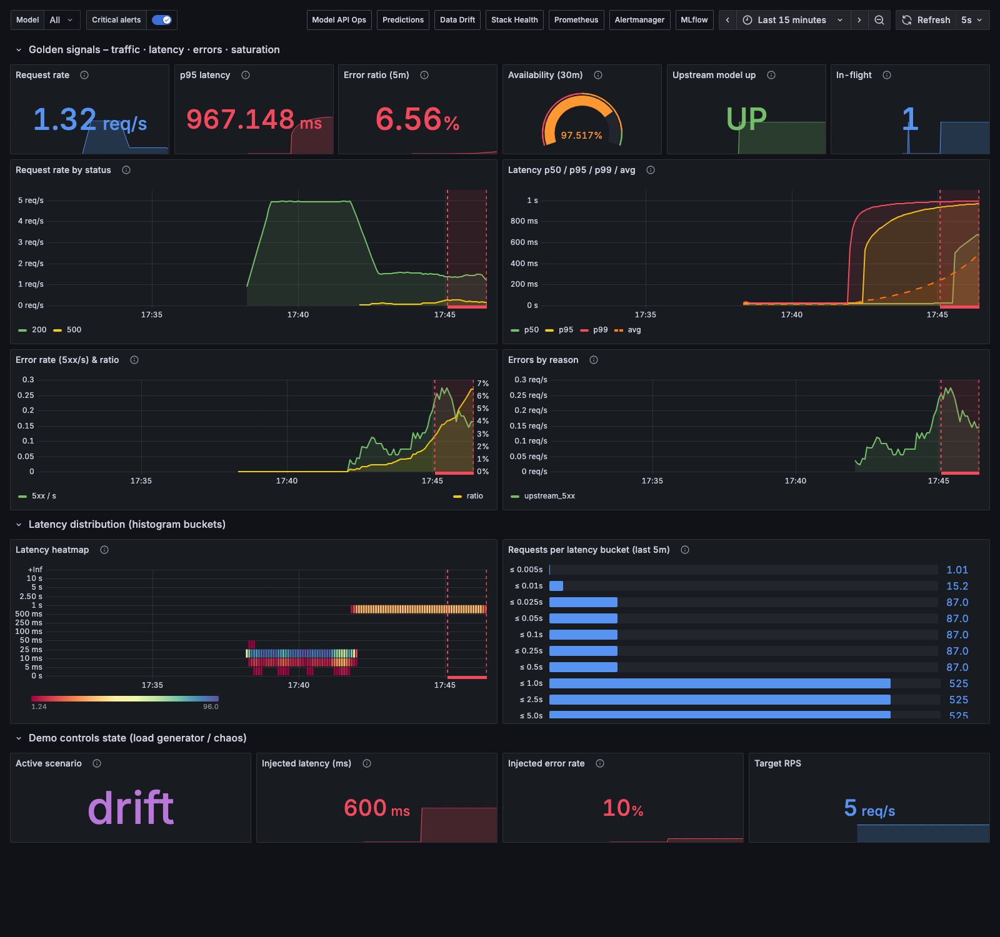
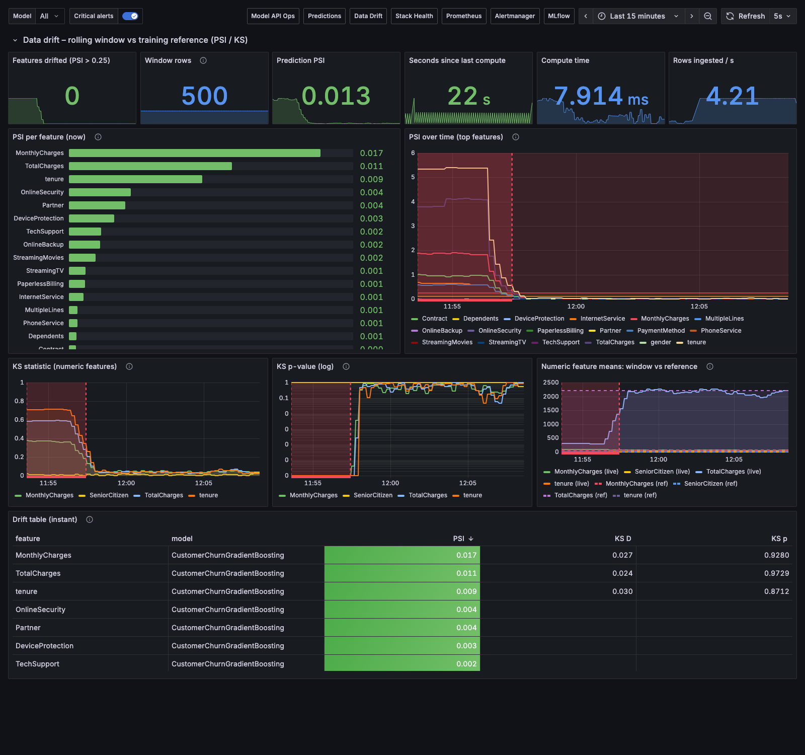

<div class="cover">
<h1>Real-Time Model Monitoring &amp; Alerting Stack</h1>
<p>MLOps Project 4 — Project Report</p>
<p>Team 4 · wrapped around the Telco Customer-Churn model</p>
<p>Repository: <a href="https://github.com/AutomationArtist01/MLOPS">https://github.com/AutomationArtist01/MLOPS</a></p>
<p style="margin-top:40pt;font-size:10pt;color:#666">Full technical guidebook (why every tool, alternatives, PromQL, demo, Q&amp;A): <code>docs/Team4-Monitoring-Guidebook.pdf</code></p>
</div>

# 1 · Objective

Machine-learning services fail *silently*: an endpoint keeps answering `200 OK` while the model's input
distribution drifts away from the training data, or a serving bug scrambles the features. Infrastructure
monitoring (CPU, memory, uptime) cannot see this.

**Objective.** Build a **reusable, model-agnostic observability stack** that gives any deployed model —
starting with the Telco Customer-Churn classifier built by the *customer-churn-mlops* team — real-time
visibility of its **operational health** (request rate, latency p50/p95/p99, error rate) and its **ML
health** (prediction distribution, data drift via PSI and the KS-test on a rolling window), and that
**alerts humans** through Slack and e-mail via Alertmanager, all orchestrated with Docker Compose and
documented so it can be wired to any new model service.

**Dataset.** IBM Telco Customer Churn — 7 043 customers, 19 features (4 numeric, 15 categorical),
26.5 % churners. It is the dataset the wrapped model was trained on, so it is used (a) to retrain and
tune the model in our own ZenML + Optuna pipeline, (b) as the drift *reference* distribution and (c) to
replay realistic traffic. No new dataset was required by the assignment.

**Success metrics (defined up-front).**

| Area | Metric | Target | Achieved |
|---|---|---|---|
| Model quality | hold-out ROC-AUC (primary), F1 | ≥ 0.84 · registry gate ≥ 0.80 | **see §5** |
| Serving SLOs | p95 latency · 5xx ratio · availability (30 m) | < 500 ms · < 5 % · ≥ 99 % | p95 ≈ 25 ms baseline; alerts fire on breach |
| Drift detection | PSI / KS per feature; time-to-detect | PSI > 0.25 flagged ≤ 3 min | 6 features flagged ~2 min after shift |
| Alerting | routing correctness, grouping | 100 % of scenarios delivered | 12 Slack + 4 e-mail notifications, correct channels |
| Reusability | wiring a new model | env vars + 1 scrape job | proven with the other team's *unmodified* image |

**Hour budget (15 h).** Exporters 5 h · Docker Compose 3 h · Dashboards 3 h · Alertmanager 2 h · Docs/demo 2 h.

# 2 · Architecture

```
                       demo scenarios (normal / drift / latency / errors / burst / bad_payload)
                       ┌───────────────────┐
                       │  load-generator   │ :8090  (samples real Telco rows, POSTs to gateway)
                       └────────┬──────────┘
                                │ POST /predict
                                ▼
┌───────────────┐      ┌───────────────────┐  POST /predict   ┌───────────────────────┐
│  any client   │─────►│  monitoring       │─────────────────►│  model-api  :8000     │
│  (curl, app)  │◄─────│  GATEWAY  :8080   │◄─────────────────│  churn model (FastAPI │
└───────────────┘      │  /metrics mlgw_*  │  JSON response   │  + MLflow/skops)      │
                       └───┬───────────┬───┘                  │  /metrics prediction_*│
                           │           │ async POST /ingest   └───────────┬───────────┘
                           │           ▼                                  │ /chaos (demo only)
                           │  ┌───────────────────┐                       │
                           │  │  drift-exporter   │ :9105                 │
                           │  │  rolling window   │ PSI + KS vs reference │
                           │  │  /metrics drift_* │                       │
                           │  └─────────┬─────────┘                       │
   scrape (pull) every 5s  │            │                                 │
┌──────────────────────────┴────────────┴─────────────────────────────────┴──────┐
│  PROMETHEUS :9090     TSDB · 10 recording rules (ml:*) · 14 alert rules        │
└──────────┬──────────────────────────────────────────────────┬─────────────────┘
           │ alerts (push)                                     │ PromQL
           ▼                                                   ▼
┌───────────────────────┐  Slack webhook  ┌──────────┐    ┌───────────────────────────┐
│  ALERTMANAGER :9093   │────────────────►│ Slack    │    │  GRAFANA :3000            │
│  group·route·inhibit  │  SMTP           │ (catcher)│    │  4 provisioned dashboards │
└───────────────────────┘────────────────►│ Mailhog  │    └───────────────────────────┘
                                          └──────────┘
┌───────────────────────┐    ┌──────────────────────────────────────────────────────┐
│  MLFLOW :5001         │◄───│  trainer = ZenML pipeline: ingest → validate(gate) → │
│  tracking + registry  │    │  split → Optuna tune (25 trials) → evaluate →         │
└───────────────────────┘    │  register(@champion) → drift reference → CSV          │
                             └──────────────────────────────────────────────────────┘
```

Every box is a container in `docker-compose.yml`. Prometheus also scrapes itself, Alertmanager,
Grafana and MLflow (meta-monitoring). The **gateway** makes the stack model-agnostic: it proxies
`/predict` to any HTTP model (`UPSTREAM_URL`, `PREDICT_PATH`, `PROB_FIELD`, `LABEL_FIELD` env vars),
records the four operational signals + prediction distribution with a `model` label, and streams
feature rows to the drift exporter asynchronously (never on the request path).

**Key design decisions** (details and alternatives in the guidebook): Prometheus *pull* model (free
health detection, central config) · **histograms** not summaries (server-side p50/p95/p99, aggregatable) ·
gateway/sidecar instrumentation **plus** in-process metrics in the model (both shown, trade-offs
documented) · PSI (numeric + categorical, interpretable thresholds 0.10/0.25) **and** KS-test
(bin-free statistical test) on a 500-row count-based rolling window · Prometheus alert rules →
Alertmanager (versioned YAML, grouping, inhibition, silences) rather than Grafana-managed alerts ·
dashboards generated as code · Docker Compose over Kubernetes for a single-host, one-command demo.

# 3 · Implementation

## 3.1 Data pipeline & orchestration (ZenML)

`services/trainer/pipeline.py` — `@pipeline churn_training_pipeline` with eight `@step`s:

| Step | What it does | Gate |
|---|---|---|
| `ingest_data` | reads the CSV | — |
| `validate_data` | schema (23 required columns), `TotalCharges` coercion, null share ≤ 5 %, target ∈ {Yes, No}, minority class ≥ 10 %, non-negative tenure | **raises → pipeline halts** |
| `split_data` | stratified 80/20, target → 0/1 | — |
| `tune_and_train` | Optuna TPE + MedianPruner, 25 trials, 3-fold CV ROC-AUC, **every trial a nested MLflow run**; best config retrained on full train split | — |
| `evaluate_model` | hold-out AUC/accuracy/precision/recall/F1 logged to the parent run with the model artifact (signature + input example) | — |
| `register_model` | promotes to `telco-churn-classifier` with alias `champion` and tag `stage=production` | **refuses AUC < 0.80** |
| `build_drift_reference` | writes the PSI/KS reference profile (quantile bins, category shares, training-score histogram) for the drift exporter | — |
| `export_runs_csv` | all runs → `artifacts/mlflow_runs.csv` | — |

Steps are cached by ZenML (except tuning) and artifacts are versioned in ZenML's store; the unit tests
exercise the validation gate on real data with a missing column and an artificially imbalanced target
(both halt).


## 3.2 Experiment tracking & tuning (MLflow + Optuna)

Search space: `n_estimators` 50–300, `learning_rate` 0.01–0.3 (log), `max_depth` 2–6,
`min_samples_split` 2–20, `min_samples_leaf` 1–10, `subsample` 0.6–1.0 (`GradientBoostingClassifier`,
same family the other team used). Sampler **TPE** (seeded), pruner **Median** (partial-CV reporting)
— pruned trials are logged as such. Parent run holds `best_cv_roc_auc`, `trials_pruned`, the
per-trial table (`optuna_trials.json`) and parameter importances (`optuna_param_importance.json`).


## 3.3 Monitoring & observability (Prometheus + Grafana + Alertmanager)

* **Exporters in service code**: `services/model_api/api.py` (`prediction_requests_total`,
  `prediction_request_latency_seconds` histogram, `prediction_errors_total{reason}`,
  `prediction_probability` histogram, `predictions_total{predicted_class}`, `model_info`) and the
  model-agnostic `services/gateway/gateway.py` (`mlgw_*` equivalents + `mlgw_upstream_up`,
  `mlgw_inflight_requests`).
* **Custom drift exporter** `services/drift_exporter/drift_exporter.py`: `drift_psi{feature,type}`,
  `drift_ks_statistic/pvalue{feature}`, `drift_prediction_psi`, `drift_features_drifted`, window and
  liveness gauges; PSI = Σ(a−e)·ln(a/e) on reference-quantile bins (open outer bins, ε-smoothing,
  "other" bucket for unseen categories); two-sample KS from `scipy`.
* **Prometheus** `monitoring/prometheus/prometheus.yml` (9 jobs, 5 s scrape) + 10 recording rules
  (SLIs: `ml:latency_p95:5m`, `ml:error_ratio:5m`, `ml:availability:30m`, `ml:positive_rate:5m` …)
  + 14 alert rules in two groups (operational / ML-quality) with `for:` durations, severities and
  runbook links.
* **Alertmanager**: routes by severity/category to Slack channels and e-mail, grouping, three
  inhibition rules, custom Slack template; env-substituted so a real webhook/SMTP is one `.env` away.
* **Grafana**: four dashboards generated by `monitoring/grafana/build_dashboards.py` (57 panels,
  units, thresholds, `$model` variable, alert annotations), provisioned with the Prometheus and
  Alertmanager data sources.






## 3.4 Load generator & demo scenarios

`services/load_generator` replays real customers through the gateway (5 rps) and exposes an API to
switch scenarios (`make scenario-drift | latency | errors | burst | bad | normal`): drift shifts
tenure/MonthlyCharges/Contract/InternetService/PaymentMethod; latency and errors are injected via a
demo-only `/chaos` endpoint of the model API (`CHAOS_ENABLED=0` in production/Render).

## 3.5 Tests

`tests/test_units.py` (pytest, in CI): PSI/KS maths, drift detection end-to-end on the exporter
object, gateway JSON-path helper, reference builder CLI, ZenML validation gate (pass / missing column
/ imbalance), Prometheus/alert-rule/dashboard config sanity. `tests/smoke_test.py` (23 assertions)
boots against the running stack in CI and locally (`make smoke`).

# 4 · Deployment

* **Containerisation** — one `Dockerfile` per service (`python:3.12-slim`, requirements layer cached
  before code copy, pinned dependencies via `uv pip compile`, `HEALTHCHECK` on the model API,
  `PORT`-aware start command). Official images for Prometheus, Alertmanager, Grafana, Mailhog.
* **Docker Compose** — 10 services, named volumes for Prometheus/Grafana/Alertmanager/MLflow/ZenML
  state, read-only bind mounts for configuration, `restart: unless-stopped`, `trainer` under the
  `train` profile, `docker-compose.second-model.yml` overlay to attach a second model.
* **Render** — `render.yaml` blueprint deploys `services/model_api` as a Docker web service with
  `/health` as health-check path (free plan). Live URL: **see repository README / LMS submission** —
  the local stack monitors it by pointing a gateway's `UPSTREAM_URL` at the Render URL.
* **CI/CD** — `.github/workflows/ci.yml` on every push/PR: Ruff lint → pytest → `promtool check
  config/rules` → `amtool check-config` → `docker compose config` → dashboards reproducible from code
  → **build all six images** (pushed to GHCR on `main`) → **compose smoke test** (boots the whole
  stack in the runner and runs the 23 assertions).


# 5 · Results

## 5.1 Model (ZenML + Optuna run)

| Metric | Value |
|---|---|
| Optuna trials / pruned | **{{TRIALS}}** / {{PRUNED}} |
| Best CV ROC-AUC | **{{CV_AUC}}** |
| Best params | {{BEST_PARAMS}} |
| Hold-out ROC-AUC | **{{TEST_AUC}}** |
| Hold-out F1 / precision / recall / accuracy | {{TEST_F1}} / {{TEST_PREC}} / {{TEST_REC}} / {{TEST_ACC}} |
| Registered | `telco-churn-classifier` v{{VERSION}} → alias `champion`, tag `stage=production` |

(Other team's baseline: Optuna 35 trials, ROC-AUC 0.845 on their split.)

## 5.2 Monitoring scenarios (all verified live)

| Scenario | Observed | Alerts fired | Routed to |
|---|---|---|---|
| normal (5 rps) | p95 ≈ 25 ms, error ratio 0 %, PSI < 0.15 on all features | — | — |
| latency (700 ms injected) | p95 ≈ 0.9 s, p99 ≈ 1 s, avg ≈ 0.7 s | HighLatencyP95 | Slack #ml-alerts |
| errors (30 % injected) | error ratio 16 % over 5 m | HighErrorRate (critical) | Slack #ml-oncall + e-mail |
| drift (population shift) | PSI up to 5.4 on tenure, 6 features > 0.25, KS D > 0.4, prediction PSI 0.81 | FeatureDriftHigh ×6, FeatureDriftKS ×3, MultipleFeaturesDrifted (critical), PredictionDrift | Slack #ml-quality / #ml-oncall + e-mail |
| second model (other team's original image) | monitored with zero code changes; same customer scores 0.069 vs 0.087 | — | — |


## 5.3 A real finding

The other team's `api.py` fits its `ColumnTransformer` with transformers ordered *(categorical,
numeric)* while the model was trained with *(numeric, categorical)*; because a NumPy array is passed
to `predict`, scikit-learn cannot detect the mismatch. On the training CSV the correct order gives
**AUC 0.94 / mean score 0.25**, the API's order **AUC 0.53 / mean score 0.09** — the live Render
deployment silently returns scrambled predictions. Our stack surfaces exactly this class of bug through
the prediction-distribution metrics (`PredictionDrift`, `PositiveRateAnomaly`) while every operational
signal stays green; the fix in `services/model_api/api.py` is a one-line transformer reorder.

# 6 · Challenges

| Challenge | Resolution |
|---|---|
| Version pins of the other team's artifact (sklearn 1.9.0 + skops + MLflow 3.15) | matched exactly in `model_api`; `uv pip compile` pins for every service |
| MLflow 3 rejects unknown `Host` headers (`Invalid Host header`) | `--allowed-hosts` for both the in-network name and the host port |
| macOS AirPlay occupies port 5000 | MLflow mapped to 5001 |
| `rate()` over a not-yet-existing 5xx series returns *empty*, not 0 → "No data" panels | zero-fill with `or (… * 0)` in recording rules |
| Alertmanager has no env-var substitution | tiny entrypoint that `sed`s the config from env |
| KS p-value → 0 with large n, alerts too eager | require effect size `D > 0.2` as well |
| Drift table in Grafana joins by labels | aggregate `by (model, feature)` so `merge` aligns |
| A second monitored model with no traffic tripped `NoTraffic` | rule now means "traffic dropped" (`max_over_time(...[30m]) > 0.5`) |
| Detection latency at low traffic (500-row window at 1.4 rps ≈ 6 min) | documented; window size is a tuning knob (`WINDOW_SIZE`) |
| Bug discovered in the wrapped model | fixed in our copy, documented, reported to the other team |

# 7 · Conclusion

The stack meets and exceeds the assignment: exporters for request rate, latency percentiles, error
rate and prediction distribution; a custom PSI + KS drift exporter on a rolling window; Grafana
dashboards and 14 alert rules routed to Slack and e-mail through Alertmanager; a one-command Docker
Compose stack with the sample model API; and documentation (guidebook + wiring guide) that lets another
team attach their model with environment variables only — demonstrated with a second, unmodified
model. On top of the monitoring scope it ships a ZenML pipeline with a gating validation step, Optuna
tuning tracked in MLflow with registry promotion, CI that lints, tests, validates configs, builds images
and smoke-tests the whole stack, and a Render deployment of the model API.

**Next steps:** logs/traces (Loki/Tempo, OpenTelemetry), long-term storage (Thanos/Mimir), an accuracy
exporter once ground-truth labels arrive, segmented drift, and an automatic retraining trigger from the
`MultipleFeaturesDrifted` alert into the ZenML pipeline.

---
*Repository: https://github.com/AutomationArtist01/MLOPS · Guidebook: `docs/Team4-Monitoring-Guidebook.pdf` · Reproduce: `make up && make train && make smoke`*
